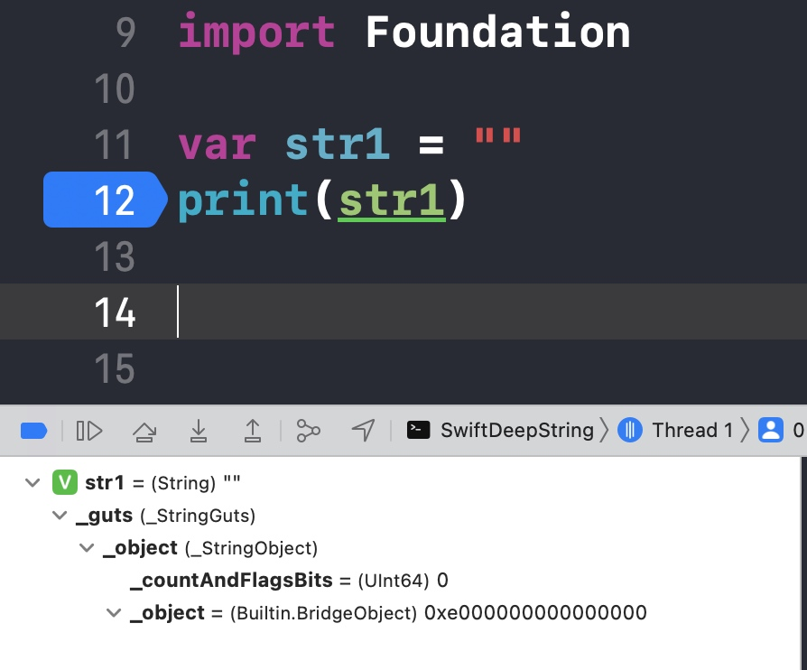
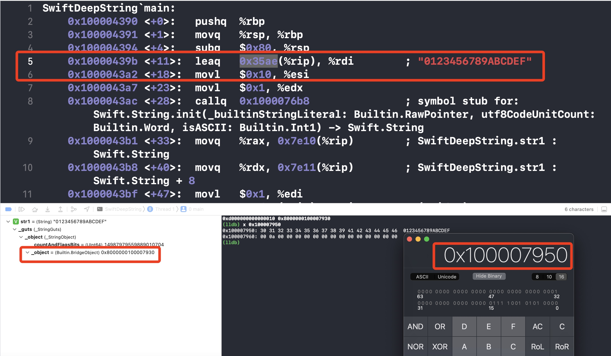

今天我们通过查看内存、汇编以及 `Swift` 源码等多途径来探究一下 `Swift` 中的 `String` 的内存布局及底层实现。

## 空字符串

首先创建一个最简单的字符串，空字符串`str1`：


从图中可以看到，`String` 内部有个 `_StringGuts`，`_StringGuts` 内部有个 `_StringObject`，`_StringObject` 内部有个 `Builtin.BridgeObject` 类型的`_object` 和一个 `UInt64` 类型的 `_countAndFlagsBits`。


找到 [StringGuts](https://github.com/swiftlang/swift/blob/0d4a5853bf665eb860ad19a16048664899c6cce3/stdlib/public/core/StringGuts.swift) 源码，可以看到 `_StringGuts` 是一个结构体，里面有个 `_StringObject` 类型的成员 `_object`，跟上面 `Xcode` 打印的一致。


搜索关键词 `empty`，可以轻松找到创建空字符串的初始化方法：调用 `_StringObject`的方法empty:() 生成一个空的 `_StringObject` 对象后传入到自身默认初始化方法：init(_ object: _StringObject) 中。


进一步查看 [StringObject](https://github.com/swiftlang/swift/blob/main/stdlib/public/core/StringObject.swift) 源码，同样搜索关键词 `empty`，找到方法：init(empty:())。因为我们的设备是64位，所以这个方法会进入到第一个分支中，分别初始化成员：`_countAndFlagsBits` 和 `_object`（也跟图一的打印保持一致）。


` Nibbles` 是个枚举，源码中给它加了多个`extension`。进一步查看源码可以看到 `Nibbles.emptyString`，调用方法：`small(isASCII: Bool)`

``` Swift
enum Nibbles {}

extension _StringObject.Nibbles {
  // The canonical empty string is an empty small string
  @inlinable @inline(__always)
  internal static var emptyString: UInt64 {
    return _StringObject.Nibbles.small(isASCII: true)
  }
}

extension _StringObject.Nibbles {
  // Discriminator for small strings
  @inlinable @inline(__always)
  internal static func small(isASCII: Bool) -> UInt64 {
#if os(Android) && arch(arm64)
    return isASCII ? 0x00E0_0000_0000_0000 : 0x00A0_0000_0000_0000
#else
    return isASCII ? 0xE000_0000_0000_0000 : 0xA000_0000_0000_0000
#endif
  }
```

## 非空字符串

由上面的分析，我们可以猜想到一个字符串变量至少占用了16字节。用 `MemoryLayout` 工具进行验证也确实是16个字节。

``` Swift
var str1 = ""
print(MemoryLayout.size(ofValue: str1)) //16
```

### 小字符串
那么这16个字节是如何分配的呢？先把空字符 `str1` 的内容稍微改为："1"，并且借助 MJ 的内存小工具[Mems](https://github.com/CoderMJLee/Mems) 直接打印变量地址及内容

``` Swift
var str1 = "1"
print(Mems.ptr(ofVal: &str1))
print(Mems.memStr(ofVal: &str1))

/*
0x000000010000c1c8
0x0000000000000031 0xe100000000000000
(lldb) x 0x000000010000c1c8
0x10000c1c8: 31 00 00 00 00 00 00 00 00 00 00 00 00 00 00 e1  1...............
0x10000c1d8: 00 00 00 00 00 00 00 00 ff ff ff ff ff ff ff ff  ................
*/
```
当然，我们也可以打断点查看


以上我们可以看到，字符串其中一个字节内容为0x31（"1"的十六进制ASCII值）。此时`(Builtin.BridgeObject) _object = 0xe100000000000000`，对比之前空字符串的`(Builtin.BridgeObject) _object = 0xe000000000000000`，我们可以猜想`_object`的其中一位可能存放字符串的长度。带着这种猜想，我们去进一步验证一下。

``` Swift
var str1 = "0123456789ABCDE"
print(Mems.memStr(ofVal: &str1))
//0x3736353433323130 0xef45444342413938
```
我们发现当字符串的长度不超过15时，打印结果跟猜想的一致。

### 大字符串

``` Swift
var str1 = "0123456789ABCDEF"
print(Mems.memStr(ofVal: &str1))
//0xd000000000000010 0x8000000100007930
```

当字符串长度大于15时，打印结果显示前8个字节的其中一个字节内容为：`0x10`，也就是字符串的长度16，后8个字节内容为：`0x8000000100007930`。16个字节没有直接保存字符串内容，那么很有可能其中一部分内容保存着字符串的地址。带着这种猜想，我们结合断点跟汇编一起分析。



通过第5、6行汇编计算得到字符串内容地址`0x100007950`，并读取内容，确实存放着`0123456789ABCDEF`。断点处也可以看到`(Builtin.BridgeObject) _object = 0x8000000100007930`，也就是说字符串变量地址的其中8个字节内容的恰好是`(Builtin.BridgeObject) _object`的地址。

不难发现`0x8000000100007930`的后面一串跟`0x100007950`很接近。是否存在某种联系呢？

``` 
0x100007950 = 0x100007930 + 0x20
```
`0x20`，即十进制的32，其实就是地址偏移。这点在源码中可以找到。综上，我们可以初步得出结论，当字符串长度大于15时，字符串变量的其中8个字节保存着字符串长度等信息，另外8个字节保存着字符串内容的地址等信息。


``` Swift
extension _StringObject {
  @inlinable @inline(__always)
  internal static var nativeBias: UInt {
#if _pointerBitWidth(_64)
    return 32
#elseif _pointerBitWidth(_32)
    return 20
#elseif _pointerBitWidth(_16)
    // TODO: we need to revisit all of this when we decide on efficient
    // structures for storing String on 16-bit platforms
    return 12
#else
#error("Unknown platform")
#endif
  }
```

我们也可以通过工具`MachOView`直接查看字符串 `0123456789ABCDEF` 在 `Mach-O` 文件中的位置。在`__TEXT`的`__cstring`中（常量区）找到了它。


## StringObject

继续查看 `StringObject`的源码，一步步撕开它的面纱。开宗明义，注释直接说明`StringObject`抽象了 `String struct` 位级别的解释和创建。在64位平台上，有个4位的重要鉴别器。标识是否小字符串、大字符串、桥接、ASCII、原生、共享、外来等。


接下来简化一下结构体`_StringObject`中主要内容：

``` Swift
struct _StringObject {

    enum Nibbles {}

    struct CountAndFlags {
        var _storage: UInt64
    }

#if $Embedded
  public typealias AnyObject = Builtin.NativeObject
#endif

#if _pointerBitWidth(_64)

    var _countAndFlagsBits: UInt64
    var _object: Builtin.BridgeObject
  
#elseif _pointerBitWidth(_32) || _pointerBitWidth(_16)

    enum Variant {
        case immortal(UInt)
        case native(AnyObject)
        case bridged(_CocoaString)
    }

    var _count: Int
    var _variant: Variant
    var _discriminator: UInt8
    var _flags: UInt16
    var _countAndFlagsBits: UInt64
    
#else
#error("Unknown platform")
#endif
}
```
由上我们可以看到：
* 在64位平台，`_StringObject` 中有 `_countAndFlagsBits` 和 `_object` 两个成员。允许小字符串内容自然地矢量对齐。
* 在32或者16位平台，`_StringObject` 中有一个枚举 `_variant`成员和 `_count`、`_discriminator`、`_flags`、`_countAndFlagsBits`。
* 枚举`Variant`中有三个成员：`immortal`、`native`、`bridged`。很显然这些取值会影响鉴别器 `_discriminator` 的状态。


第201行-325行主要根据平台对 `_StringObject` 进行相应的初始化操作。后面开始介绍大字符串，也就是第341行开始，第二小节第4张图片中所示。

* 大字符串可以是：原生的、共享的和外来的
* 原生字符串具有尾部分配的存储空间，该存储空间从偏移量开始
`nativeBias`来自存储对象的地址
* 大字符串字面量存储在常量区，这点在上面`MachOView`小节也得到了验证
* 原生字符串始终由 `Swift` 运行时管理
* 共享字符串没有尾部分配的存储，但提供对连续`UTF-8`的访问
* 外来字符串无法提供对连续`UTF-8`的访问。外来字符串仅包含不能被视为“共享”的延迟桥接的`NSString`，可以提供对`UTF-16`的访问
* 8 字节存储`_object`，其中`b63:b60`用于存储鉴别器，剩下60位存储大字符串内容的地址（真实地址还需要加上偏移，64位平台是`0x20`）。如上面字符串`0123456789ABCDEF`的 `0x8000000100007930`中的`8`为鉴别器，剩下的都为地址，字符串真实地址 = 0x0000000100007930 + 0x20


这段及后续部分主要介绍鉴别器的一些工作，使用掩码、位操作等技术（`ObjC`的`runtime`中常见这种操作），鉴别小字符串、大字符串、原生字符串、外来字符串、`providesFastUTF8`、桥接字符串等。


这里开始介绍小字符串和空字符串（很显然，空字符串是一种特殊的小字符串）。

* 64位平台，小端模式，第一个字符存储在最低位，高位字符和计数器存储在高地址。例如最初的字符串`1`，`0x0000000000000031 0xe100000000000000`
* 32位平台，存储空间变少，但仍然采用类似布局


这里是非small，也就是大字符串的布局：

* `_object`和非对象部分对半共享一个字的存储单元，也就是说各8个字节
* 非对象部分的8个字节，高5位，即`b63:b59`是标志位，`b58:b48`是保留位，剩下部分存储着字符串的长度

源码剩余部分主要是一些初始化器、查询器、访问器、前置检查、辅助器以及聚合查询与抽象等。

## 总结

* `struct String` -> `struct _StringGuts` -> `struct _StringObject`
    
    - 64位平台，`_StringObject` 包含 `_countAndFlagsBits` 和 `_object`
    - 32及16位平台，`_StringObject` 包含 `_count`、`_variant`、`_discriminator`、`_flags`和`_countAndFlagsBits`

* 在我们iOS开发中，一个`Swift`字符串变量占用16个字节内存
* 当字符串的长度 `count` <= 15 时，即 `small string`，字符串变量地址的前15个字节直接存储着字符串内容，后一个字节的高4位，存储着一些标志位，低4位存储着字符串的长度 `count`
* 当字符串的长度 `count` > 15 时，即 `large string`，字符串变量地址的其中8个字节存储着`_countAndFlagsBits`，8个字节存储着`_object`。其中`_countAndFlagsBits` 8字节中的高5位是标志位，即`b63:b59`；`b47:b0`存储着大字符串的长度 `count`；剩下的 `b58:b48`是保留位。而 `_object` 8字节的高4位是标志位，即`b63:b60`；剩下60位间接存储大字符串内容的地址`address`（字符串的真实地址 = `address` + 偏移`nativeBias`，64位平台是32，32位平台是20，16位平台是12）。
    